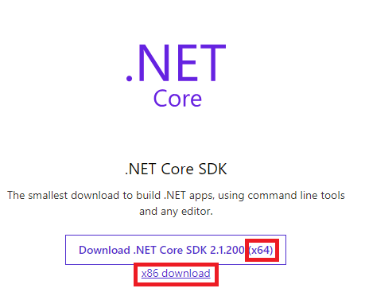
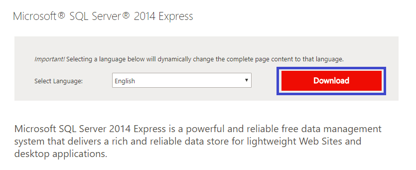
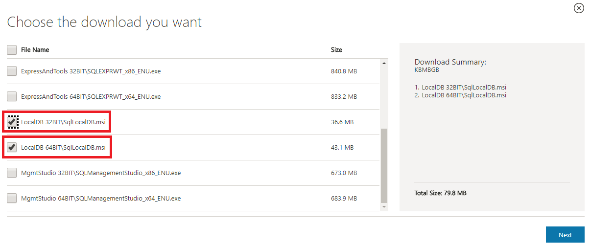
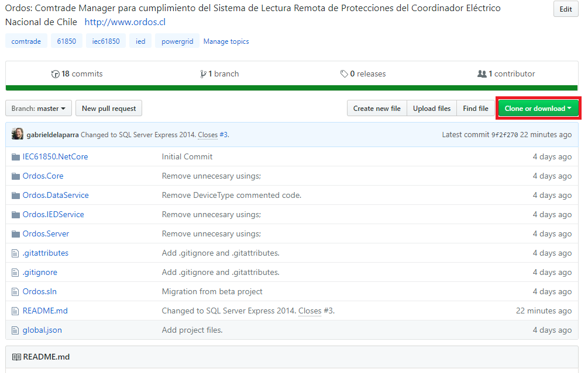
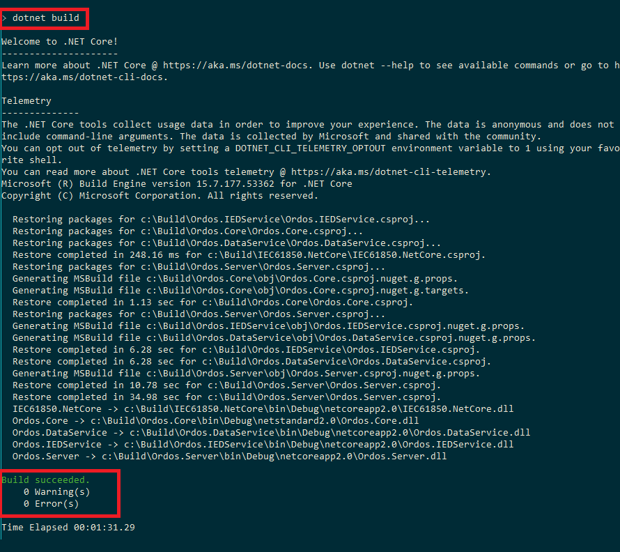
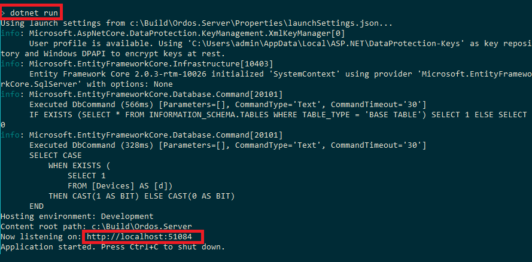

# Ordos
Ordos: Comtrade Manager para cumplimiento del Sistema de Lectura Remota de Protecciones del Coordinador Eléctrico Nacional de Chile.

## Instrucciones

### 1. Descargar e instalar [.Net Core](https://www.microsoft.com/net/download) (x86 o x64).

En el sitio, hacer click sobre la versión que corresponda: 
<kbd>
  
</kbd>

### 2. Instalar [SQL Server Express 2014 - LocalDb](https://www.microsoft.com/en-us/download/details.aspx?id=42299) (x86 o x64)

Hacer click sobre el botón de descargar: 
<kbd>
  
</kbd>

Seleccionar la versión que corresponda: 
<kbd>
  
</kbd>

### 3. [Clonar](https://help.github.com/articles/cloning-a-repository/) o [descargar](https://github.com/gabrieldelaparra/Ordos/archive/master.zip) el repositorio.

Clonar o descargar: 
<kbd>
  
</kbd>

### 4. Entrar a la carpeta `Ordos` (en la consola: `cd Ordos`)

### 5. En la consola, ejecutar `build`

Build: 
<kbd>
  
</kbd>

### 6. En la consola, ejecutar `ordos`

Run: 
<kbd>
  
</kbd>

Las oscilografías se extraen a la carpeta `C:\Ordos\` según los requerimientos del SLRP.

## Contribuciones
La herramienta está en versión beta.

Cualquier duda o comentario, pueden [crear un Issue](https://help.github.com/articles/creating-an-issue/).

## Dependencias
Este proyecto utiliza las siguientes dependencias: 
- [libiec61850](https://github.com/mz-automation/libiec61850) 
- [Fluent Scheduler](https://github.com/fluentscheduler/FluentScheduler)
